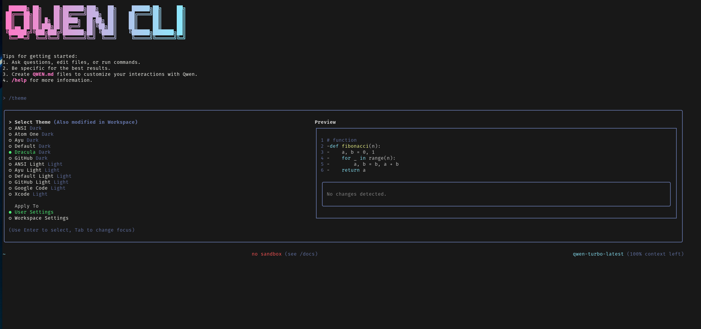

# Qwen CLI - Community Fork

[English](./README.md) | [简体中文](./README_CN.md)

> **A community fork of Google's Gemini CLI, modified to work with Qwen models from Alibaba Cloud**



This repository contains a community-maintained fork of Google's Gemini CLI, modified to work with Qwen models. It's a command-line AI workflow tool that connects to your tools, understands your code and accelerates your workflows using Qwen's powerful language models.

## Attribution

This project is a community fork of [Google's Gemini CLI](https://github.com/google-gemini/gemini-cli), originally developed by Google. We've modified it to work with Qwen models from Alibaba Cloud while maintaining the excellent architecture and functionality of the original project.

**Original Project**: [google-gemini/gemini-cli](https://github.com/google-gemini/gemini-cli)  
**Original License**: Apache License 2.0  
**This Fork**: Community-maintained, independent project

## What You Can Do

With the Qwen CLI you can:

- Query and edit large codebases using Qwen's 131k+ token context window
- Generate new apps from PDFs or sketches, using Qwen's multimodal capabilities
- Automate operational tasks, like querying pull requests or handling complex rebases
- Use tools and MCP servers to connect new capabilities
- Advanced vision capabilities with Qwen VL models for image analysis and processing
- **Switch between multiple Qwen models** with an intuitive dialog interface
- **Use the CLI in Chinese or English** with full localization support
- **Multi-agent task coordination** for parallel processing and complex workflows

## Quickstart

> **Note**: This is a community fork. Installation requires building from source as it's not published to npm registries.

1. **Prerequisites:** Ensure you have [Node.js version 18](https://nodejs.org/en/download) or higher installed.

2. **Clone and Build:**
   ```bash
   git clone https://github.com/[your-username]/qwen-cli-fork
   cd qwen-cli-fork
   npm install
   npm run build
   npm run bundle
   ```

3. **Run the CLI:**
   ```bash
   node bundle/qwen.js
   ```

4. **Set up Authentication:** Configure your Qwen API key and base URL from Alibaba Cloud DashScope:
   ```bash
   export DASHSCOPE_API_KEY="your-api-key-here"
   # or
   export QWEN_API_KEY="your-api-key-here"
   
   # Base URL (choose based on your region):
   # For Chinese mainland users:
   export QWEN_BASE_URL="https://dashscope.aliyuncs.com/api/v1"
   
   # For international users:
   export QWEN_BASE_URL="https://dashscope-intl.aliyuncs.com/api/v1"
   ```

5. **Pick a color theme** and start using the CLI!

You are now ready to use the Qwen CLI fork!

### Getting Your Qwen API Key

1. Create an account at [Alibaba Cloud DashScope](https://dashscope.console.aliyun.com/)
2. Navigate to the API Keys section in your dashboard
3. Create a new API key for DashScope services
4. Set it as an environment variable as shown above

**Important Regional Configuration:**
- **Chinese mainland users**: Use `https://dashscope.aliyuncs.com/api/v1`
- **International users**: Use `https://dashscope-intl.aliyuncs.com/api/v1`

The CLI will automatically detect and use the appropriate endpoint based on your `QWEN_BASE_URL` setting. If not set, it defaults to the international endpoint.

### Supported Models

This fork supports the following Qwen models:
- **qwen-turbo-latest** - Fast model with 1M context window
- **qwen3-235b-a22b** - Most capable model with 131k context window  
- **qwen-vl-plus-latest** - Vision model for image analysis (32k context)

For detailed model specifications, see our [model documentation](./docs/providers/qwen.md).

## Key Features

### 🌐 Multilingual Support
Switch between English and Chinese with the `/lang` command:
- Full UI translation (menus, help text, command descriptions)
- System prompts automatically adapt to selected language
- Settings are persisted across sessions

### 🤖 Dynamic Model Switching
Easily switch between Qwen models with the `/model` command:
- Interactive dialog showing all available models
- Model specifications (context window, output tokens, vision support)
- Seamless switching without restarting the CLI

### ⌨️ Consistent User Experience
All configuration commands now use a unified dialog pattern:
- `/theme` - Change visual themes
- `/auth` - Switch authentication methods  
- `/lang` - Change interface language
- `/model` - Switch Qwen models

### 🔍 Web Search Integration
The CLI includes powerful web search capabilities through MCP (Model Context Protocol) servers:

**Quick Setup:**
```bash
# In the CLI, run:
/setup-mcp websearch
```

This automatically configures DuckDuckGo search for privacy-focused web search. You can then use web search in your conversations:

```text
> Search for the latest TypeScript 5.7 features and help me understand them
```

**Manual Setup (Optional):**
If you prefer manual configuration, add to your `.qwen/settings.json`:
```json
{
  "mcpServers": {
    "duckduckgo": {
      "command": "npx",
      "args": ["-y", "@oevortex/ddg_search"]
    }
  }
}
```

**Management Commands:**
- `/mcp` - Check configured MCP servers and their status
- `/setup-mcp` - Show available MCP setup options
- `/tools` - List all available tools including web search

### 🔧 Dynamic MCP Server Management
The CLI now features advanced MCP server management capabilities with interactive dialogs and AI-powered installation:

**Interactive MCP Menu:**
```bash
# Launch the interactive MCP management interface
/mcp
```

This opens a comprehensive menu with four options:
- **🔍 Browse Servers** - Explore MCP servers by category (Development, Search, Database, etc.)
- **🔎 Search Servers** - Find servers by name or functionality
- **📦 Install Server** - Configure and install servers with scope and trust settings
- **📋 List Servers** - View currently configured MCP servers

**AI-Powered Installation:**
The CLI can now install MCP servers automatically when you need new capabilities:

```text
> I need to search the web for information
# AI will automatically install and configure DuckDuckGo search server

> Help me manage my PostgreSQL database
# AI will find and install the PostgreSQL MCP server

> I want to integrate with Slack
# AI will discover and set up the Slack MCP server
```

**Built-in MCP Server Catalog:**
The CLI includes a curated catalog of popular MCP servers:
- **DuckDuckGo Search** - Privacy-focused web search
- **File Manager** - Advanced file operations
- **GitHub Integration** - Repository and issue management
- **PostgreSQL** - Database operations
- **Slack** - Team communication
- **AWS S3** - Cloud storage management
- **Memory Server** - Persistent context storage
- **Cloud Storage** - Multi-cloud file operations

**MCP Tools for AI:**
- **`add_mcp_server`** - Install and configure MCP servers programmatically
- **`search_mcp_servers`** - Discover available servers by category or keyword

**Example Workflows:**
```text
> Find and install all development-related MCP servers
# AI will search for and present development tools

> Set up MCP servers for a web development project
# AI will install servers for search, database, and file management

> Show me what communication servers are available
# AI will list Slack, Discord, and other communication integrations
```

### 🚀 Multi-Agent Task Coordination
Revolutionary parallel processing capabilities that enable sophisticated workflow automation:

**Core Multi-Agent Tools:**
- **`spawn_sub_agent`** - Launch independent Qwen CLI instances for isolated tasks
- **`delegate_task`** - Split complex work into coordinated subtasks with parallel/sequential execution
- **`aggregate_results`** - Combine and analyze outputs from multiple agents

**Key Capabilities:**
- **Parallel Processing:** Execute up to 5 concurrent agents simultaneously
- **Intelligent Scheduling:** Priority-based task queue with timeout management
- **Resource Management:** Automatic load balancing and memory optimization
- **Result Synthesis:** Multiple aggregation formats (summary, merge, compare, analyze)

**Example Multi-Agent Workflows:**
```text
> Analyze this entire codebase using multiple agents: one for security issues, one for performance bottlenecks, and one for code quality metrics
```

```text
> Set up a new project with parallel tasks: create frontend structure, set up backend APIs, configure database, and write documentation
```

```text
> Run comprehensive testing: unit tests, integration tests, and performance benchmarks all in parallel, then aggregate the results
```

For detailed usage examples, see the [Multi-Agent System Documentation](./docs/multi-agent-system.md).

## Examples

Once the CLI is running, you can start interacting with Qwen from your shell.

You can start a project from a new directory:

```sh
cd new-project/
node /path/to/bundle/qwen.js
> Write me a Discord bot that answers questions using a FAQ.md file I will provide
```

Or work with an existing project:

```sh
git clone https://github.com/[your-username]/qwen-cli-fork
cd qwen-cli-fork
node bundle/qwen.js
> Give me a summary of all of the changes that went in yesterday
```

### Next steps

- Learn how to [contribute to this community fork](./CONTRIBUTING.md)
- Explore the available **[CLI Commands](./docs/cli/commands.md)**
- If you encounter any issues, review the **[Troubleshooting guide](./docs/troubleshooting.md)**
- For more comprehensive documentation, see the [full documentation](./docs/index.md)
- Take a look at some [popular tasks](#popular-tasks) for more inspiration
- Check out the [original Gemini CLI](https://github.com/google-gemini/gemini-cli) for updates and comparisons

### Troubleshooting

Head over to the [troubleshooting](docs/troubleshooting.md) guide if you're
having issues.

## Popular tasks

### Explore a new codebase

Start by `cd`ing into an existing or newly-cloned repository and running the Qwen CLI.

```text
> Describe the main pieces of this system's architecture.
```

```text
> What security mechanisms are in place?
```

### Work with your existing code

```text
> Implement a first draft for GitHub issue #123.
```

```text
> Help me migrate this codebase to the latest version of Java. Start with a plan.
```

### Automate your workflows

Use MCP servers to integrate your local system tools with your enterprise collaboration suite.

```text
> Make me a slide deck showing the git history from the last 7 days, grouped by feature and team member.
```

```text
> Make a full-screen web app for a wall display to show our most interacted-with GitHub issues.
```

### Multi-agent coordination

Leverage the power of parallel processing for complex tasks.

```text
> Use multiple agents to simultaneously refactor the authentication system, update the API documentation, and create comprehensive tests
```

```text
> Analyze this monorepo with dedicated agents for each microservice, then aggregate findings into a single architecture report
```

```text
> Set up a complete CI/CD pipeline: one agent configures Docker, another sets up GitHub Actions, and a third creates deployment scripts
```

### Interact with your system

```text
> Convert all the images in this directory to png, and rename them to use dates from the exif data.
```

```text
> Organise my PDF invoices by month of expenditure.
```

## Community Fork Notice

This is a community-maintained fork of Google's Gemini CLI. It is not affiliated with, endorsed by, or supported by Google or Alibaba Cloud. 

- **Original Project**: [google-gemini/gemini-cli](https://github.com/google-gemini/gemini-cli) by Google
- **This Fork**: Community project for Qwen model integration
- **Support**: Community-based support through GitHub issues
- **License**: Apache License 2.0 (same as original)

For the original project's terms of service and privacy notice, see the [original repository](https://github.com/google-gemini/gemini-cli).

### Contributing to This Fork

We welcome contributions to improve Qwen model integration and CLI functionality. Please see [CONTRIBUTING.md](./CONTRIBUTING.md) for guidelines specific to this community fork.
