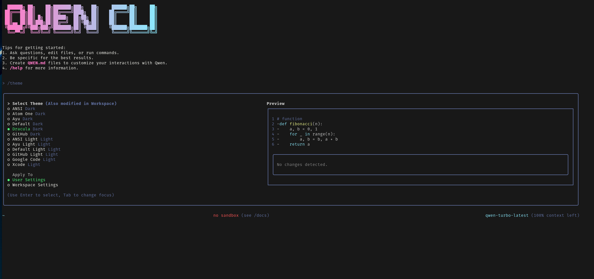

# Qwen CLI - 社区分支

[English](./README.md) | 简体中文

> **Google Gemini CLI 的社区分支，已修改为支持阿里云通义千问模型**



此仓库包含一个由社区维护的 Google Gemini CLI 分支，经过修改以支持通义千问模型。这是一个命令行 AI 工作流工具，能够连接您的工具、理解您的代码，并使用通义千问强大的语言模型加速您的工作流程。

## 项目来源

本项目是 [Google Gemini CLI](https://github.com/google-gemini/gemini-cli) 的社区分支，原项目由 Google 开发。我们对其进行了修改以支持阿里云的通义千问模型，同时保留了原项目卓越的架构和功能。

**原始项目**: [google-gemini/gemini-cli](https://github.com/google-gemini/gemini-cli)  
**原始许可**: Apache License 2.0  
**本分支**: 社区维护的独立项目

## 功能特性

使用 Qwen CLI，您可以：

- 利用通义千问 131k+ token 的上下文窗口查询和编辑大型代码库
- 使用通义千问的多模态能力，从 PDF 或草图生成新应用
- 自动化操作任务，如查询拉取请求或处理复杂的代码合并
- 使用工具和 MCP 服务器连接新功能
- 使用通义千问视觉语言模型进行高级视觉能力的图像分析和处理
- **通过直观的对话界面在多个通义千问模型之间切换**
- **支持中文和英文界面**，完整的本地化支持
- **多智能体任务协调**，用于并行处理和复杂工作流程

## 快速开始

> **注意**: 这是一个社区分支。安装需要从源代码构建，因为它未发布到 npm 仓库。

1. **前置条件:** 确保您已安装 [Node.js 18](https://nodejs.org/en/download) 或更高版本。

2. **克隆并构建:**
   ```bash
   git clone https://github.com/dinoanderson/qwen_cli_coder
   cd qwen_cli_coder
   npm install
   npm run build
   npm run bundle
   ```

3. **运行 CLI:**
   ```bash
   node bundle/qwen.js
   ```

4. **设置认证:** 配置您的阿里云 DashScope 通义千问 API 密钥和基础URL：
   ```bash
   export DASHSCOPE_API_KEY="your-api-key-here"
   # 或
   export QWEN_API_KEY="your-api-key-here"
   
   # 基础URL（根据您的地区选择）：
   # 中国大陆用户：
   export QWEN_BASE_URL="https://dashscope.aliyuncs.com/api/v1"
   
   # 国际用户：
   export QWEN_BASE_URL="https://dashscope-intl.aliyuncs.com/api/v1"
   ```

5. **选择一个颜色主题**，开始使用 CLI！

您现在可以使用 Qwen CLI 分支了！

### 获取通义千问 API 密钥

1. 在[阿里云 DashScope](https://dashscope.console.aliyun.com/) 创建账户
2. 导航到仪表板中的 API 密钥部分
3. 为 DashScope 服务创建新的 API 密钥
4. 按上述说明设置为环境变量

**重要的地区配置:**
- **中国大陆用户**: 使用 `https://dashscope.aliyuncs.com/api/v1`
- **国际用户**: 使用 `https://dashscope-intl.aliyuncs.com/api/v1`

CLI 将根据您的 `QWEN_BASE_URL` 设置自动检测并使用适当的端点。如果未设置，默认使用国际端点。

### 支持的模型

本分支支持以下通义千问模型：
- **qwen-turbo-latest** - 快速模型，拥有 100万 token 上下文窗口
- **qwen3-235b-a22b** - 最强大的模型，拥有 131k token 上下文窗口
- **qwen-vl-plus-latest** - 用于图像分析的视觉模型（32k 上下文）

有关详细的模型规格，请参阅我们的[模型文档](./docs/providers/qwen.md)。

## 核心功能

### 🌐 多语言支持
使用 `/lang` 命令在英语和中文之间切换：
- 完整的界面翻译（菜单、帮助文本、命令描述）
- 系统提示自动适应所选语言
- 设置在会话之间保持

### 🤖 动态模型切换
使用 `/model` 命令轻松切换通义千问模型：
- 显示所有可用模型的交互式对话框
- 模型规格（上下文窗口、输出令牌、视觉支持）
- 无需重启 CLI 即可无缝切换

### ⌨️ 一致的用户体验
所有配置命令现在都使用统一的对话框模式：
- `/theme` - 更改视觉主题
- `/auth` - 切换认证方法
- `/lang` - 更改界面语言
- `/model` - 切换通义千问模型

### 🔍 网络搜索集成
CLI 通过 MCP（模型上下文协议）服务器包含强大的网络搜索功能：

**快速设置:**
```bash
# 在 CLI 中运行：
/setup-mcp websearch
```

这会自动配置 DuckDuckGo 搜索以进行隐私优先的网络搜索。然后您可以在对话中使用网络搜索：

```text
> 搜索最新的 TypeScript 5.7 功能并帮我理解它们
```

**手动设置（可选）:**
如果您更喜欢手动配置，添加到您的 `.qwen/settings.json`：
```json
{
  "mcpServers": {
    "duckduckgo": {
      "command": "npx",
      "args": ["-y", "@oevortex/ddg_search"]
    }
  }
}
```

**管理命令:**
- `/mcp` - 检查配置的 MCP 服务器及其状态
- `/setup-mcp` - 显示可用的 MCP 设置选项
- `/tools` - 列出所有可用工具，包括网络搜索

### 🚀 多智能体任务协调
革命性的并行处理能力，实现复杂的工作流程自动化：

**核心多智能体工具:**
- **`spawn_sub_agent`** - 启动独立的通义千问 CLI 实例执行隔离任务
- **`delegate_task`** - 将复杂工作拆分为协调的子任务，支持并行/顺序执行
- **`aggregate_results`** - 合并和分析来自多个智能体的输出

**主要功能:**
- **并行处理:** 同时执行最多 5 个并发智能体
- **智能调度:** 基于优先级的任务队列和超时管理
- **资源管理:** 自动负载均衡和内存优化
- **结果合成:** 多种聚合格式（摘要、合并、比较、分析）

**多智能体工作流示例:**
```text
> 使用多个智能体分析整个代码库：一个负责安全问题，一个负责性能瓶颈，一个负责代码质量指标
```

```text
> 并行任务设置新项目：创建前端结构、设置后端API、配置数据库和编写文档
```

```text
> 运行全面测试：单元测试、集成测试和性能基准测试并行运行，然后汇总结果
```

详细使用示例请参见[多智能体系统文档](./docs/multi-agent-system.md)。

## 使用示例

CLI 运行后，您可以从 shell 开始与通义千问交互。

您可以从新目录开始一个项目：

```sh
cd new-project/
node /path/to/bundle/qwen.js
> 为我编写一个 Discord 机器人，使用我将提供的 FAQ.md 文件回答问题
```

或处理现有项目：

```sh
git clone https://github.com/dinoanderson/qwen_cli_coder
cd qwen_cli_coder
node bundle/qwen.js
> 给我一个昨天所有更改的摘要
```

### 下一步

- 了解如何[为这个社区分支做贡献](./CONTRIBUTING.md)
- 探索可用的 **[CLI 命令](./docs/cli/commands.md)**
- 如果遇到任何问题，请查看 **[故障排除指南](./docs/troubleshooting.md)**
- 有关更全面的文档，请参阅[完整文档](./docs/index.md)
- 查看一些[常见任务](#常见任务)以获得更多灵感
- 查看[原始 Gemini CLI](https://github.com/google-gemini/gemini-cli) 了解更新和比较

### 故障排除

如果遇到问题，请前往[故障排除](docs/troubleshooting.md)指南。

## 常见任务

### 探索新的代码库

首先 `cd` 进入现有或新克隆的仓库并运行 Qwen CLI。

```text
> 描述这个系统架构的主要部分。
```

```text
> 有哪些安全机制？
```

### 处理现有代码

```text
> 为 GitHub 问题 #123 实现一个初稿。
```

```text
> 帮我将这个代码库迁移到最新版本的 Java。先制定一个计划。
```

### 自动化工作流程

使用 MCP 服务器将您的本地系统工具与企业协作套件集成。

```text
> 为我制作一个幻灯片，展示过去 7 天的 git 历史，按功能和团队成员分组。
```

```text
> 制作一个全屏网页应用，用于墙面显示，展示我们互动最多的 GitHub 问题。
```

### 多智能体协调

利用并行处理的力量处理复杂任务。

```text
> 使用多个智能体同时重构身份验证系统、更新API文档并创建全面的测试
```

```text
> 用专门的智能体分析这个单体仓库的每个微服务，然后将发现汇总到一个架构报告中
```

```text
> 设置完整的CI/CD管道：一个智能体配置Docker，另一个设置GitHub Actions，第三个创建部署脚本
```

### 与系统交互

```text
> 将此目录中的所有图像转换为 png，并使用 exif 数据中的日期重命名它们。
```

```text
> 按支出月份整理我的 PDF 发票。
```

## 社区分支声明

这是 Google Gemini CLI 的社区维护分支。它与 Google 或阿里云无关，也未得到其认可或支持。

- **原始项目**: Google 的 [google-gemini/gemini-cli](https://github.com/google-gemini/gemini-cli)
- **本分支**: 用于通义千问模型集成的社区项目
- **支持**: 通过 GitHub issues 提供基于社区的支持
- **许可**: Apache License 2.0（与原始项目相同）

有关原始项目的服务条款和隐私声明，请参阅[原始仓库](https://github.com/google-gemini/gemini-cli)。

### 为本分支做贡献

我们欢迎贡献以改进通义千问模型集成和 CLI 功能。请参阅 [CONTRIBUTING.md](./CONTRIBUTING.md) 了解特定于此社区分支的指南。